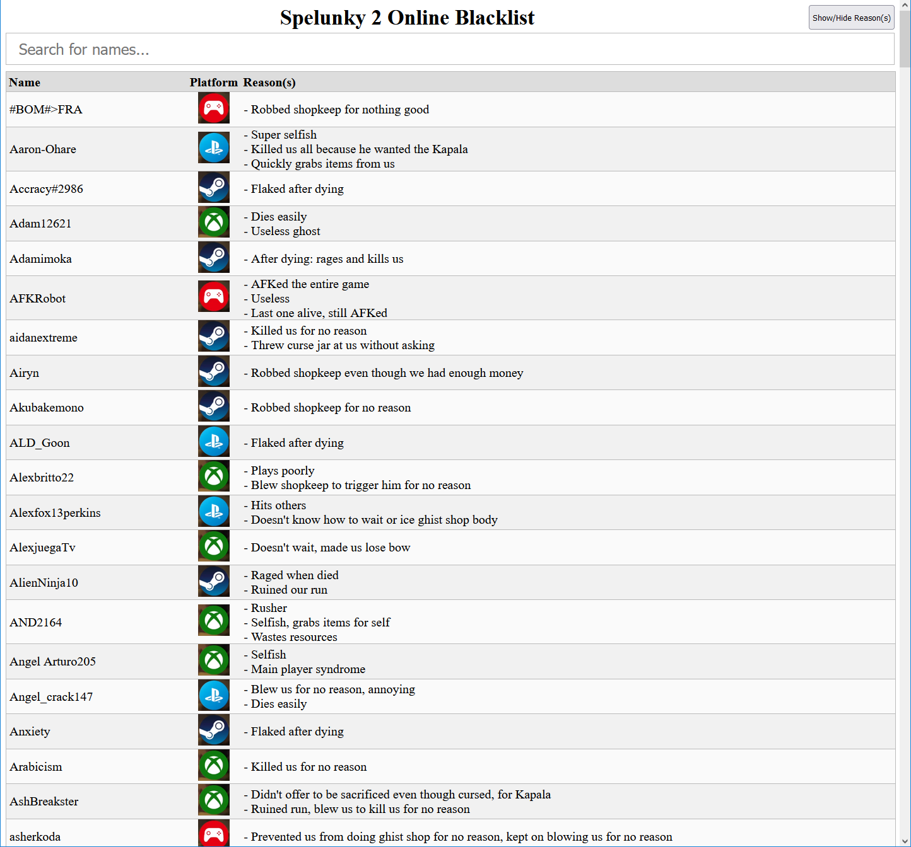

# Spelunky 2 Online Blacklist
Searchable list of players in Spelunky 2 Online that you do **NOT** want to play with.

## Try it out here:
https://pusheenhater.github.io/Spelunky-2-Online-Blacklist/

## Explanation of the common reasons (listed from least to most worst):
Note: Many players on the blacklist have overlaps.

### Newbie
- Newbies are good if they are patient, but when they are impatient then it messes with the run too much
- For example:
  - Enter challenges without knowing what to do
  - Exits level, making us miss things (challenges, etc)

### Flaker
- Leaves game after dying, doesn't want to wait to be revived
- Disadvantaged with less players in the run
- Acceptable if other player is bad/toxic and you don't want to play with them anymore

### Robber
- Robs the shopkeeper, triggering him and making it harder for possibly the rest of the run
- There are acceptable cases. For example, many bomb boxes in the shop and we don't have enough money
- There are cases that are not good enough: robbing when we have enough money, robbing when there's nothing good in the store, or robbing for no reason at all

### AFKer
- It's okay to occasionally AFK
- But when they AFK most of the game then it's annoying
- When there's one AFK and three players have died then it literally ends the game
- Or when they AFK for most of the early game but comes back later on, as if they were too lazy to play the early game parts

### Rusher
- Doesn't wait for other players and rushes to exit the level
- Makes us lose money, dog, jar, bow, etc

### Selfish
- When a player is too greedy you don't really want to play with them
- For example:
  - Rushes to the shop to buy everything for themselves
  - Doesn't share any items or healing
  - Waits at the Kali Altar to grab the items (especially Kapala) after someone sacrifices
  - Picks other players up to sacrifice without asking
  - Throws Curse Pot at others without asking, especially when they have the lower health
  - Main player syndrome; plays like others don't exist
  - Picks other players up to use to trigger arrow traps
  - Whips others to get their crate

### Toxic
- When a player is so toxic that the run is instantly unsalvageable just by having the player there
- For example:
  - Anger issues
  - Rages when mistakes are made
  - Whips/damages other players on purpose
  - As a ghost, keeps freezing or blowing us
  - Ropes/bombs us at the beginning
